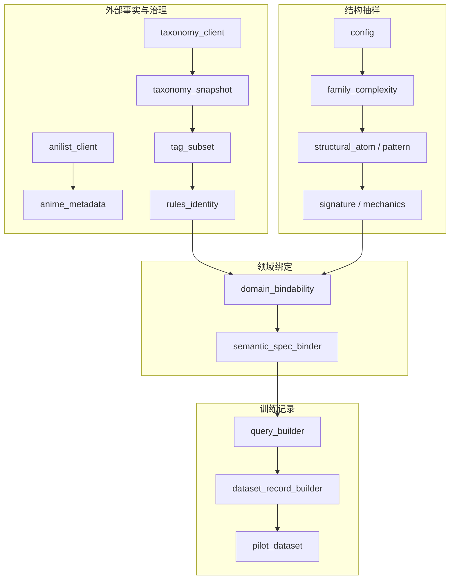
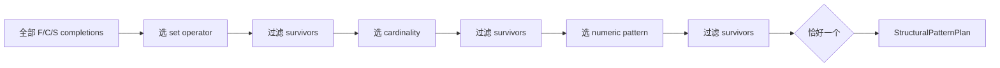
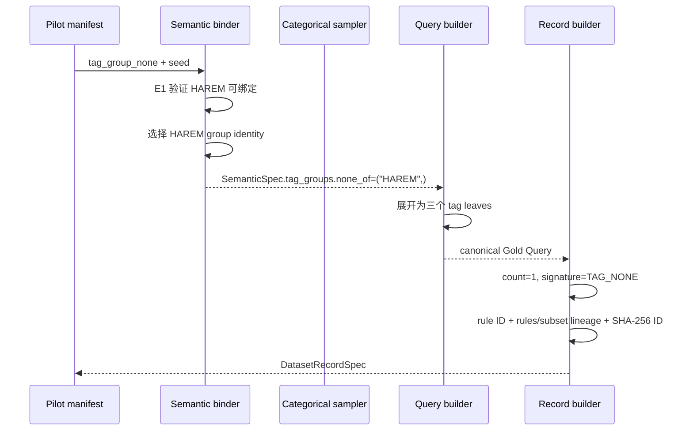

# Anime Preference 模块实现详解

> 本文专门解释“代码是怎样实现的”。全局目标和使用方式见
> [项目实现学习手册](项目实现学习手册.md)。这里按源码模块拆解输入、输出、内部算法、
> 依赖方向、失败方式和测试入口，避免恢复过去“一项 TODO 一份文档”的碎片结构。

## 1. 先理解分层原则

项目把一个样本拆成五类问题：

1. 外部事实是否可信：Media/taxonomy acquisition。
2. 哪些值允许执行：audit、subset、DomainRules。
3. 样本应有什么结构：family、complexity、atom、signature、mechanics。
4. 结构能否在当前 domain 填入值：bindability、concrete binder。
5. 输出是否一致可追溯：Gold、DatasetRecord、hash、pilot audit。



依赖通常从右侧高层调用左侧低层真值函数。低层模块刻意不知道 DatasetRecord 或自然语言，
防止同一规则被复制到多个地方。

## 2. schemas：数据形状

`src/anime_pref/schemas/` 主要使用 `@dataclass(frozen=True)`。frozen 阻止字段重新赋值，
却不递归冻结内部 mapping/list；因此 loader 常把 mapping 包装为只读结构，validator 仍不可少。

### 2.1 查询语义

| 类 | 字段 | 设计理由 |
|---|---|---|
| `SetConstraintSpec` | all_of、any_of、none_of tuple | tuple 表示 canonical、不可就地增删的输入 |
| `RangeConstraintSpec` | min、max | None 明确表示没有表达该边界 |
| `SemanticSpec` | genres/tags/groups/year/episodes/formats/status/reference/soft/unresolved | 保存展开前语义，tag_groups 不能丢 |

这些类不在 `__post_init__` 中校验。原因是结构校验与 DomainRules 绑定需要额外上下文；
统一由 builder 处理，避免 dataclass 构造器内出现不完整的第二套规则。

### 2.2 Taxonomy 与规则来源

`TaxonomyTagSpec` 保存全局 tag 的 ID/name/description/category/adult/spoiler；没有 rank。
`CanonicalTaxonomySnapshot` 保存可哈希内容；`TaxonomySnapshotManifest` 保存来源、时间、
数量与 hash。获取时间独立于内容，避免每次抓取都改变内容身份。

`TagAuditRecordSpec` 保存人工 approved 决策与 source snapshot hash。
`ExecutableTagSubset` 只保存批准结果和来源 hash；`ExecutableTagSubsetManifest` 保存子集身份。

### 2.3 抽样阶段对象

| 类 | 它已经决定了什么 | 它还没决定什么 |
|---|---|---|
| `FamilyComplexityPlan` | semantic family、复杂度 bucket | 字段、operator、值 |
| `OperatorCardinalityPlan` | set operator 与项目数 | genre/tag 值 |
| `DirectCategoricalValuePlan` | 一个字段的具体值 | operator |
| `DirectNumericRangePlan` | field、pattern 与 endpoints | 其他字段 |
| `StructuralAtom` | 一个 value-free slot 及 mechanics | concrete value |
| `StructuralPatternPlan` | family/bucket 下完整 atom tuple | concrete value |
| `StructuralSignature` | atom kinds 的存在 | mechanics 与值 |
| `TagGroupBindingPlan` | any/none group identity | 展开后的 Gold |
| `ReferenceTitlePoolSpec` | 可选 reference titles | 本次选择 |

这种拆分让每一步输出都只能携带自己应当决定的信息。例如 Phase B 的对象中不会意外提前
出现 genre，测试会检查这种 phase boundary。

### 2.4 Dataset 与 Pilot

`DatasetRecordSpec` 同时保存源语义、Gold 和 provenance。新增的
executable_subset_version/hash 与 rules_version/hash 使记录绑定到实际可执行环境。
`PilotPatternCase` 保存一个人工审查的结构、模板、split 和 seed schedule；
`PilotPatternManifest` 是全部 cases 的版本化集合。

## 3. Media acquisition 模块

### 3.1 anilist_client.py

`ANIME_PAGE_QUERY` 明确选取作品字段。`fetch_anime_page(page, per_page, ...)`：

```text
参数前置校验
→ {"query": ..., "variables": ...}
→ UTF-8 JSON bytes
→ urllib.request.Request(method="POST")
→ urlopen(timeout)
→ HTTP status
→ UTF-8 decode + json.loads
→ GraphQL errors
→ data.Page/media/pageInfo/hasNextPage 结构
→ 返回 Page dict
```

HTTP 200 不表示 GraphQL 成功，因此 errors 独立检查。HTTPError、URLError 和解码/结构异常
被转换为 RuntimeError，并通过 `raise ... from exc` 保留原始原因。

### 3.2 anime_metadata.py

`AnimeMetadata.from_api(media)` 是一条 Media 的 runtime validator：

- int 字段显式排除 bool；
- title 内三个值允许 str 或 None；
- genres 必须是字符串 list；
- tags 每项必须有 name/rank，rank 在 0–100；
- 成功后创建 AnimeTag 列表和 AnimeMetadata。

它是校验视图，采集器仍写 raw Media。这保留来源字段，后续 schema 改变时可以重做视图。

### 3.3 io.py 与 fetch_anilist.py

`write_jsonl` 用 `open("x")` 独占创建，逐条 dumps 并计数，不要求 iterable 有长度。
`write_manifest` 同样独占创建。with 只保证关闭文件，不提供跨文件事务。

CLI 的 `main` 先合并 JSON config 与 CLI override，再验证 endpoint、pages、per_page、timeout。
dry-run 在联网前返回。普通路径分页请求、逐条验证、写 page 文件，只在全部循环成功后写
manifest。退出码 0/1/2 分别表示成功、运行错误和学习骨架异常。

对应测试：[test_scaffold.py](../tests/test_scaffold.py)。其中 end-to-end 测试替换了网络函数，
覆盖脚本内部链，不是实际 HTTP 端到端。

## 4. Taxonomy snapshot 与 executable subset

### 4.1 taxonomy_client.py

`fetch_anilist_taxonomy` 与 Media 客户端采用同类 HTTP 防线，但返回完整 decoded response。
它只确认两个 collection 是 list，不排序、裁剪或生成 hash；这样 source snapshot 忠于来源。

### 4.2 taxonomy_snapshot.py

`build_canonical_taxonomy_snapshot` 的核心是“筛选后再稳定化”：

1. 精确读取 data 下两个资源；
2. 校验 genre canonical string 与唯一性；
3. tag 精确保留六个合同字段；
4. 校验正整数 ID、name/category、description、两个 bool；
5. 分别拒绝重复 ID 和 name；
6. genres 字符串排序，tags 按 (id,name) 排序；
7. 创建 frozen snapshot，不修改 source。

`canonical_taxonomy_to_mapping` 再次验证 snapshot 并构造全新 JSON mapping。
`dumps_canonical_taxonomy` 使用 Unicode compact JSON；`taxonomy_snapshot_sha256` 对该
字符串的 UTF-8 bytes 哈希。`load_canonical_taxonomy_snapshot` 要求文件已经 canonical，
不会读取后静默排序。

`write_taxonomy_snapshot_bundle` 先在内存构建 snapshot/manifest，再预检三个目标均不存在，
然后独占写 source.json、canonical.json、manifest.json。它降低“写到一半才发现冲突”的风险，
但磁盘中途失败仍可能留下部分 bundle。

### 4.3 tag_subset.py

`load_tag_audit` 使用 object_pairs_hook 检测重复 JSON keys，再检查每条记录精确字段。
`validate_tag_audit` 建立 snapshot 的 ID 与 name 索引，逐项验证：

- source_snapshot_hash 完全相等；
- ID/name 指向同一个 tag；
- category/adult/spoiler 与快照相同；
- audit ID/name 不重复；
- approved aliases 在内部、跨记录及与 canonical names 间不冲突。

`build_executable_tag_subset` 先验证 audit，只选择 `approved is True`，同时排除 adult 和
general spoiler，规范排序 aliases 与 tags。reason 留在 audit，不进入可执行内容。

mapping/dumps/hash/load 函数形成同 snapshot 一样的 canonical round trip。
`validate_domain_rule_tag_targets` 检查 group leaves 属于 active tags，active tags 属于
approved subset。`write_executable_subset_bundle` 写两个文件并拒绝覆盖。

对应测试：[test_taxonomy_snapshot.py](../tests/test_taxonomy_snapshot.py)。测试分别固定
输入顺序不影响 hash、合同字段变化影响 hash、遗漏 approved 不获批、重复身份与敏感 tag 拒绝。

## 5. Rules、Gold Query 与 DatasetRecord

### 5.1 query_builder.py：加载 DomainRules

`load_domain_rules(path)` 对顶层、taxonomy、tag_groups、numeric_rules 使用精确键集合。
allowlist 先 strip 配置项再查重，正式 SemanticSpec 则拒绝首尾空白；这是配置输入与
canonical 语义输入的不同政策。

TagGroupRule 保存展开 leaves、许可 operators 和 normalization_rule_id。
NumericRule 保存 validity minimum/maximum。DomainRules 还保存 rules/subset/schema 的
version/hash。loader 先构造没有派生 hash 的规则内容，重算 canonical rules hash，再核对
配置中声明的 hash，防止规则文件内容和身份漂移。

### 5.2 rules_identity.py

`canonical_rules_to_mapping` 验证类型、canonical strings、集合与组规则后，按固定字段顺序
重建文档，并排除派生字段 `rules_hash`，否则会出现“hash 包含自身”的循环。

`domain_rules_sha256` 调用 canonical dumps 再哈希 UTF-8 bytes。
`validate_executable_rules_identity` 同时检查：

```text
声明的 subset version/hash == 实际 subset
声明的 rules_hash == 实际 canonical rules hash
group leaves ⊆ active tags ⊆ approved subset
```

### 5.3 query_validation.py 与 domain_validation.py

结构层 `validate_query_structure` 使用内部 `require_mapping_with_keys` 检查每层精确键，
但以集合比较键，所以接受任意 JSON object 插入顺序。`require_string_list` 检查 list、
非空 canonical 字符串、重复。随后验证：

- genres/tags 的三个 operator 与跨 operator 重叠；
- year/episodes 为 int 或 None，排除 bool，min 不大于 max；
- episodes 非空边界至少为 1；
- formats/status 以及三个顶层文本 list。

领域层 `validate_query_domain` 先复用结构层，再检查 genres/tags/formats/status/soft
是否属于 rules，并把 NumericRule 用到 year/episodes。reference 与 unresolved 没有
executable vocabulary，不在此映射。

`canonicalize_query` 先结构校验，重建新 dict：键按合同顺序；set-like list 排序；
reference/soft/unresolved 保序。`dumps_query` 再输出 Unicode compact JSON。

### 5.4 build_query

`build_query(spec, rules)` 的内部闭包分工：

| 辅助函数 | 实现 |
|---|---|
| `validate_string_tuple` | 类型、非空、外部空白、重复、allowlist；按字段决定是否排序 |
| `validate_set_constraint` | 验证 all/any/none 并检查三对交集 |
| `validate_range` | int 非 bool、NumericRule、min/max 顺序 |

直接 tags 与 tag_groups 先分别验证。每个 group 必须许可当前 operator，展开 leaves 添加到
同一 operator；展开后再次检查重复和跨 operator 冲突。使用 list 追加后再检查，而不是直接
set 去重，是为了让冗余输入暴露为错误。

最终输出完整 Gold，包括所有空 list 与 null bounds，调用结构和领域 validator。HAREM
只由配置决定，不存在按名称写死的特殊 if。

### 5.5 constraint_signature.py

`build_constraint_signature` 把 hard slots 映射到 12 个固定 token。list 用 bool 判断是否
活跃，range 用 `is not None`，避免把 0 的真假和“有没有表达”混淆。没有 hard 条件返回
`NO_HARD_CONSTRAINT`。signature 不包含具体值、cardinality 或规则来源。

### 5.6 dataset_record_builder.py

`count_hard_semantic_clauses` 在 group 展开前计数：

```text
set: len(all_of) + bool(any_of) + len(none_of)
range: 每个非 None bound + 1
formats/status: 非空各 + 1
reference/soft/unresolved: + 0
direct tag ANY + group ANY: 合并为一个最终 OR clause
```

`collect_normalization_rule_ids` 先通过 build_query 验证 spec，再从展开前 tag_groups 收集
实际使用的规则 ID，排序并拒绝重复。它保留“为什么出现这些 leaves”的证据。

`_semantic_spec_to_json_mapping` 把 dataclass/tuple 转成完整 JSON types，用于 identity。
`make_sample_id` 校验所有 version/hash/family/template/seed/text，canonicalize Gold，
构造含全部参数的 identity payload，使用 sort_keys compact JSON 后计算 SHA-256。

`build_dataset_record` 内部依次构建 Gold、signature、count、normalization IDs 和 sample ID。
`validate_dataset_record` 使用保存的源字段重新构建期望 record，逐项比较，不修复错误。

对应测试：[test_query_builder.py](../tests/test_query_builder.py)、
[test_schema_contract_v011.py](../tests/test_schema_contract_v011.py)、
[test_dataset_record_builder.py](../tests/test_dataset_record_builder.py) 与
[test_rules_identity_and_record_provenance.py](../tests/test_rules_identity_and_record_provenance.py)。

## 6. sampling/config.py：配置加载与绑定

`load_sampler_config` 是严格 JSON loader。内部解析器分工：

- `_require_exact_object`：拒绝缺失或额外键；
- `_parse_weight_table`：保留规定 key order，转 immutable mapping；
- `_parse_cardinality_weights`：JSON 字符串 key 转为 int cardinality；
- `_freeze_json_object`：复制开放 key object；
- `_parse_value_tuple`：保留数值池顺序；
- `_parse_numeric_policy`：组装 numeric config。

`validate_sampler_config` 不读取 DomainRules，验证版本、seed、正有限 weights、ratio、operator
cardinality、value policy、numeric pools 和 audit tolerances。所有 float 必须 finite；
bool 不接受为 number。

`validate_sampler_config_against_domain` 再调用 rules/subset identity 校验，要求配置的 genre
priority 属于 active genres，tag priority/tier 属于 active tags，数值池落在 NumericRule
范围内。normalization family 权重大于 0 时，rules 至少有一个可用 group。

这种两阶段验证允许单独测试配置合同，同时不会把实际 domain 缺陷误写成通用配置错误。

## 7. Phase B/C/D1/D2：概率和具体原子值

### 7.1 family_complexity.py

`FAMILY_COMPLEXITY_COMPATIBILITY` 是冻结矩阵。`normalize_relative_weights` 验证非空、
正有限 weight，按输入顺序除以总和，不舍入、不修改原 mapping。

`family_probabilities` 计算 P(F)。`conditional_complexity_probabilities` 先限制到 family
兼容 buckets，再计算 P(C|F)；reference_only 直接得到 `{0:1.0}`。
`joint_family_complexity_probabilities` 严格使用 P(F)×P(C|F)，不能把原始 family weight
与 count weight 全局相乘后一次归一化。`complexity_marginal_probabilities` 对 family 求和。

`_weighted_choice` 获取一次 `rng.random()`，在 supplied choices order 上走累计半开区间，
浮点尾部回落到最后一项。`sample_family_complexity_plan` 先抽 family；非 reference_only
再抽兼容 complexity。调用方拥有 RNG，模块不创建隐藏 Random。

### 7.2 operator_cardinality.py

`validate_operator_cardinality_plan` 检查 operator 和允许的 cardinality。
`constraint_contribution` 返回 all/none 的 cardinality，any 返回 1。

`eligible_operator_cardinality_pairs` 只用于 same_field_logic，把 contribution 与 Phase B
complexity 精确匹配。概率采用层级形式：

```text
P(operator | context)
P(cardinality | operator, context)
P(operator, cardinality | context) = 两者相乘
```

`sample_operator_cardinality_plan` singleton 阶段不 draw，多候选才 draw。这样确定性路径不会
无意义地推进 RNG。

### 7.3 categorical_value.py

`_active_values` 只返回当前 active rules 词表，而不是 subset 的全部 approved 值。
`effective_value_weights` 为每个 active 值解析：

```text
priority override > tag tier weight > default weight
```

它不是相乘关系。`initial_value_probabilities` 归一化首抽分布。
`validate_direct_categorical_sampling_binding` 还检查 maximum_value_share，防止某个值在
基础分布中占比过高。

`sample_direct_categorical_values` 在验证 cardinality/capacity 后执行 sequential weighted
sampling without replacement：每轮对 remaining values 归一化、选择、删除；最后把 draw
order 排成 canonical value order。最后一个唯一候选零 draw。

### 7.4 numeric_range.py

`numeric_value_pools` 返回配置中的三组值；`numeric_pool_probabilities` 归一化 pool weights。
`base_numeric_value_probabilities` 使用公式：

```text
P0(value) = P(pool(value)) / original_pool_size
```

`conditioned_upper_probabilities(lower)` 在所有 `value >= lower` 上对 P0 全局条件化，而不是
先删值后把每个残余 pool 再均匀化。

`sample_direct_numeric_range`：

- min_only：采一个 base endpoint 作为 minimum；
- max_only：采一个 base endpoint 作为 maximum；
- bounded_range：先采 lower，再按 conditioned distribution 采 upper；
- 若有效 upper 只有 lower 本身，直接返回 equal endpoints，零 upper draw。

`validate_direct_numeric_range_plan` 最后检查 field/pattern 对应的 None 形状、顺序和
DomainRules bounds。

## 8. Phase D3/D4/D5：从 atom 到 mechanics

### 8.1 structural_atom.py

`STRUCTURAL_ATOM_KIND_ORDER` 固定九个 slot 的 canonical order。`validate_structural_atom`：

- genre_set/tag_set 必须有 OperatorCardinalityPlan，不能有 range_pattern；
- year_range/episodes_range 必须有 range_pattern，不能有 operator_plan；
- format/status/group/reference 不能带额外 payload；
- 不存在 tag_group_all kind，因为当前 normalization 合同禁止它。

`structural_atom_contribution` 复用 C 与 D2 的局部贡献真值。`structural_constraint_count`
遍历 atoms，但把 direct tag any 与 group any 记成同一个 combined TAG_ANY。调用局部贡献
函数后简单求和会错，所以总数必须用 aggregate helper。

### 8.2 structural_pattern.py

`_variants_for_kind` 为每个 slot 建立有限 mechanics 变体：set slot 展开 operator/cardinality，
numeric slot 展开三个 range patterns，其余只有一个无 payload 变体。

`_enumerate_canonical_atom_tuples` 对“unused + variants”做有限笛卡尔枚举，天然按 kind order。
`validate_structural_pattern_plan` 再检查：

1. 对应 FamilyComplexityPlan 合法；
2. atoms 为 tuple 且每项通过 D3；
3. tuple 已按 canonical order；
4. 每种 slot 最多一次；
5. exact count 匹配 bucket，5_plus 接受 >=5；
6. family-specific 规则成立。

`enumerate_eligible_structural_patterns` 用同一个 public validator 过滤并用 frozen object 去重。
它返回 tuple，不消耗 RNG。候选空间大小只表示容量，不代表 uniform 概率。

### 8.3 structural_signature.py 与 structural_signature_sampler.py

`structural_signature(pattern)` 丢弃 mechanics，只提取 canonical atom kinds。
`enumerate_eligible_structural_signatures` 对 D4 patterns 做稳定去重。

Policy loader 的每项绑定 family、complexity、atom_kinds 和 relative weight。
`canonical_relative_weight` 用稳定 binary64 表示进入 hash；policy mapping 刻意排除派生
policy_hash，再通过 compact UTF-8 JSON 计算 SHA-256。

`validate_structural_pattern_selection_policy` 把 policy 与 sampler_version、每个 B context
及实际 D4 eligible signatures 绑定；显式 allowlist 未覆盖或包含非法 signature 都失败。
`signature_probabilities` 只在该 context 的 enabled entries 内归一化。

`sample_structural_signature` 完整验证后调用 `_choose_signature_from_probabilities`；
empty 失败、singleton 零 draw、多候选复用 Phase B 的 weighted choice。

### 8.4 mechanics_probability.py 与 mechanics_sampler.py

`mechanics_candidates(F,C,S)` 是 D4 patterns 按 signature 的 canonical survivor tuple。
`feasible_set_operators`、`feasible_set_cardinalities`、`feasible_numeric_patterns` 只返回
仍有至少一个 completion 的选项。

条件概率 helpers 从 Phase A 相应 weight table 中取值，仅在 feasible support 上归一化。
`mechanics_pattern_probabilities` 可计算最终分布用于理论检查；运行时 sampler 不做一次
“最终 pattern 抽样”，而是逐阶段缩小 survivors：



`sample_mechanics_pattern` 在第一次 draw 前验证 config、F/C、signature 和 RNG。
每个多候选 conditional stage 一次 draw，singleton 零 draw；不存在重试和 fallback。
结束不是一个 candidate 时说明合同或实现漂移，直接 ValueError。

## 9. Phase E：domain capacity 与具体值绑定

### 9.1 reference_title_pool.py

`validate_reference_title_pool` 检查 version、canonical strings、唯一性和固定顺序。
`load_reference_title_pool` 严格加载 JSON，不从 AniList 作品缓存临时猜一个 reference。

### 9.2 domain_bindability.py

`feasible_tag_group_bindings` 的嵌套遍历使用排序 group names，枚举 any/none assignment：

1. operator 必须受 group 支持；
2. any 与 none 不能是同一 group；
3. 两个 expansion 不能相交；
4. 预留全部 expansion leaves；
5. 剩余 active direct tags 数量必须满足 tag_set cardinality。

`validate_structural_pattern_bindability` 先验证完整 rules/subset/config/title resources，再检查
genre capacity、实际 numeric pool binding、非空 format/status、reference title 与 group/tag
联合容量。它证明至少有一个 schema/domain assignment，不证明真实作品目录有匹配项。

### 9.3 domain_conditioned_support.py

`bindable_mechanics_candidates` 先取得 D5B tuple，再对每项调用 E1。只有 E1 的 ValueError
表示普通 zero capacity 并被过滤；其他异常继续抛出，避免吞掉程序错误。

`bindable_structural_signatures` 只遍历 D5A policy enabled signatures，保留至少有一个
bindable mechanics 的项。它使用 policy mapping 提供顺序，但不读取 probability value；
E2A 是 support 查询，不做 domain-conditioned renormalization。

### 9.4 semantic_spec_binder.py

`sample_semantic_spec_from_pattern` 的前置顺序：

```text
validate structural pattern
→ bind config/rules/subset
→ validate title pool
→ E1 bindability
→ validate rng.random
```

所有调用方可控错误都在首次 draw 前发生。具体绑定顺序固定为 group → genre → direct tag →
year → episodes → format → status → reference。

内部实现要点：

- `_choose_uniform`：canonical support，singleton 零 draw；
- `_group_constraint`：把 group identity 留在 SemanticSpec，不提前展开；
- `_reserved_group_tags`：计算完整 leaves union；
- `_sample_restricted_tag_values`：在 residual active tags 上沿用 D1 权重与不放回抽样，但不对
  条件化后的残余 universe 重跑 full-domain maximum share guard；
- `_range_constraint`：把 D2 minimum/maximum 映射为 spec.min/max；
- 返回前比较 structural 与 concrete clause count，再调用 build_query 做 Gold-valid smoke test。

## 10. pilot_dataset.py：确定性小数据集

`load_pilot_pattern_manifest` 把 JSON cases 转成 PilotPatternCase。`_parse_manifest_atom` 要求
set atom 显式给 operator/cardinality，numeric atom 显式给 range_pattern，无 payload atom
只能给 kind，不推断缺失 mechanics。

`validate_pilot_pattern_manifest` 检查：

- manifest/case/template 标识为 canonical string；
- case ID 唯一且升序；
- pattern 通过 D4 validator；
- generation family 为三种批准模板；
- template ID 精确绑定 case 与 generation family；
- 同一 template 只属于一个 split；
- seeds 为升序唯一 int；
- 总样本数在 200–300。

`_semantic_clauses` 逐字段渲染 SemanticSpec。all_of 使用“和”，any_of 使用明确“或”，
范围语言写明 inclusive 边界；group 使用人工批准的 `TAG_GROUP_REALIZATION`，不暴露 leaves。
若 soft/unresolved 非空或 spec 为空，pilot realization 直接失败。

`realize_user_text` 仅改变受控句式前缀与连接方式，不增删 semantic clauses。
`generate_pilot_records` 对 case 预检 E1，对每个 seed 创建独立 Random，调用 E3、realizer、
record builder 和 record validator。

`split_pilot_records` 按 template ownership 切分。`dataset_record_to_mapping` 与
`records_to_jsonl` 负责稳定完整输出。`audit_pilot_records` 用 Counter 汇总分布和重复；
`render_pilot_audit_markdown` 生成审计文档。

`build_human_challenge_cases` 构造 12 个训练外手写表达及确定性 Gold；
`write_pilot_artifacts` 对六个文件做冲突预检，然后用 UTF-8 独占写入。

对应测试：[test_pilot_dataset.py](../tests/test_pilot_dataset.py) 与
[test_semantic_spec_binder.py](../tests/test_semantic_spec_binder.py)。

## 11. 一条样本如何穿过模块

以 normalization case 为例：



这里有三种不同“数量”：

- expansion leaf count 是 3；
- semantic constraint count 是 1；
- signature token count 是 1。

它们回答不同问题，不能混用。

## 12. 调试时怎样定位失败

| 失败位置 | 常见含义 | 先看什么 |
|---|---|---|
| loader | JSON 形状、重复 key、非 canonical 顺序 | 配置/fixture 与 loader 测试 |
| rules identity | version/hash 或 active/approved 关系漂移 | canonical mapping 与实际 subset |
| D3/D4 validator | atom payload、slot、family/count 不匹配 | StructuralPatternPlan |
| D5 policy | context 未覆盖或 signature 非 eligible | policy entries 与 D4 enumeration |
| E1 | domain 容量为零 | active vocabulary、group reservation、title pool |
| E3 | RNG、值容量或 count smoke check | 固定 binding order |
| build_query | taxonomy、空白、operator 冲突、numeric bounds | SemanticSpec 与 DomainRules |
| record validator | 保存字段与重算字段不一致 | Gold/signature/count/hash/text |
| artifact writer | 文件已存在 | 使用新版本目录，不直接覆盖 |

不要捕获 ValueError 后随意 retry。项目很多模块刻意把 zero capacity 暴露给上层；自动降级
family/complexity 会改变冻结分布和数据语义。

## 13. 测试地图

| 模块 | 主要测试 |
|---|---|
| Media/I/O/CLI | `test_scaffold.py` |
| taxonomy/audit/subset | `test_taxonomy_snapshot.py` |
| Gold schema/validation | `test_query_builder.py`、`test_schema_contract_v011.py` |
| rules/record lineage | `test_rules_identity_and_record_provenance.py`、`test_dataset_record_builder.py` |
| config/Phase B | `test_sampler_config.py`、`test_family_complexity_planner.py` |
| C/D1/D2 | operator、categorical、numeric 三个 sampler tests |
| D3/D4/D5 | structural atom/pattern/signature/mechanics tests |
| E1/E2/E3 | domain bindability/support、semantic binder tests |
| Pilot | `test_pilot_dataset.py` |

测试不仅检查结果，还检查：

- invalid input 在首次 RNG draw 前失败；
- singleton 是否零 draw；
- 相同 RNG state 是否得到同样输出和 state advancement；
- relative weights 整体缩放是否不改变概率；
- canonical 序列化、hash 与输入顺序的关系；
- phase 输出是否没有携带下游字段；
- zero capacity 是否保持显式而不是 fallback。

运行全部测试：

```powershell
python -X utf8 -B -m unittest discover -s tests -v
```

当前基线为 380 项全部通过。测试使用 synthetic fixture 和网络 mock，不替代 production
人工审核或真实 catalog 结果验证。
