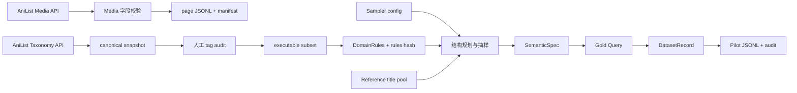
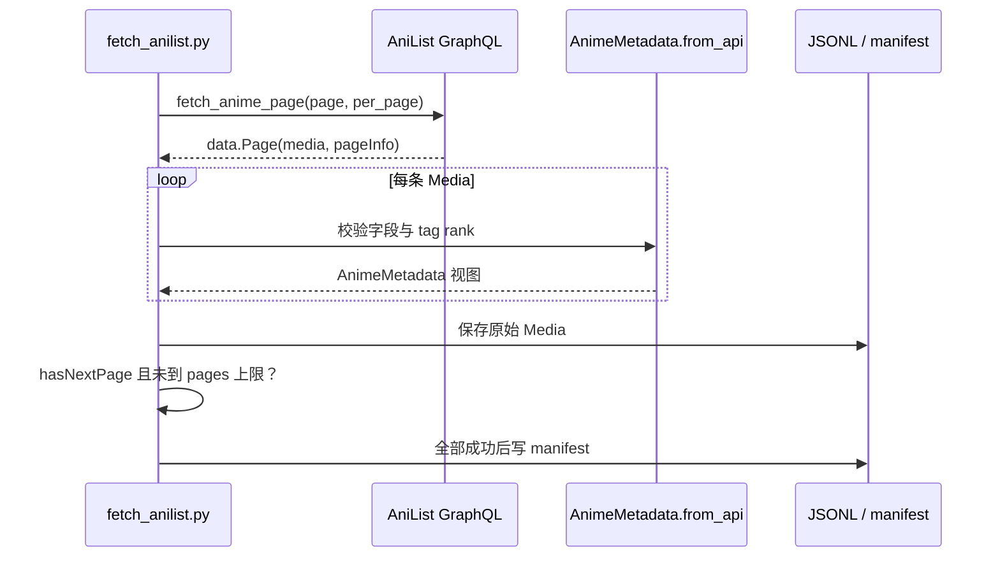
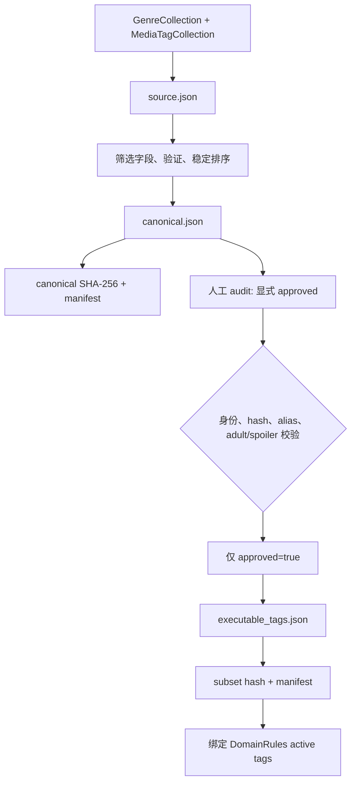
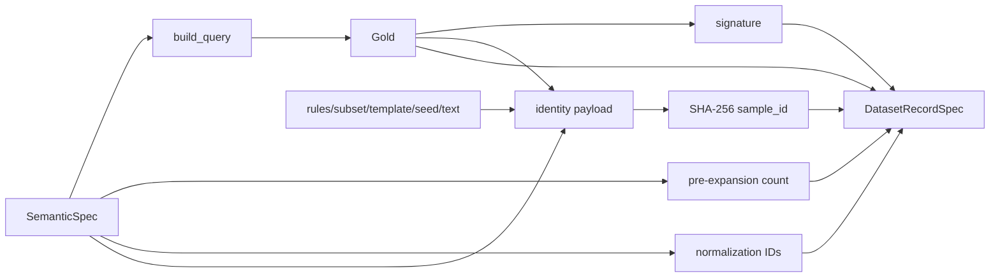

# Anime Preference 项目实现学习手册

> 更新日期：2026-09-12。本文以当前工作区代码和 380 项测试结果为准，是项目唯一的
> 主说明文档。面向第一次接触项目的读者，既讲“怎么运行”，也讲“为什么分层”。

若要继续逐模块对照源码，请阅读 [模块实现详解](模块实现详解.md)。

## 1. 项目目标与当前边界

目标任务是 **Anime Preference Understanding & Structured Recommendation Tool Calling**：
把用户明确表达的动漫偏好转换为结构化查询。例如：

```text
用户：悬疑或科幻题材都可以，2010 年以后，最多 24 集，不要后宫。

Gold：
genres.any_of = ["Mystery", "Sci-Fi"]
year.min = 2010
episodes.max = 24
tags.none_of = ["Female Harem", "Male Harem", "Mixed Gender Harem"]
```

项目采用 semantic-first：先确定 canonical SemanticSpec，再确定性构建 Gold JSON，最后
用受控模板生成自然语言。程序不会凭常识补充用户没表达的条件，也不让 LLM 自由决定 Gold。

当前已实现作品与 taxonomy 采集、人工 tag audit、可执行词表、规则身份、离线结构抽样、
具体 SemanticSpec 绑定、Gold/Record 构建，以及 240 条 pilot dataset。尚未实现模型训练、
自然语言解析、LLM paraphrase、大规模数据生成、真实目录检索和在线推荐。

## 2. 全局架构

四条链承担不同职责，通过文件、版本与 hash 关联，不共享隐含状态。



| 对象 | 表达什么 | 是否是模型目标 |
|---|---|---|
| `AnimeMetadata` | 一部作品的 API 字段校验视图 | 否 |
| `CanonicalTaxonomySnapshot` | 可哈希的全局 genre/tag 快照 | 否 |
| `ExecutableTagSubset` | 人工明确批准的 tags | 否 |
| `DomainRules` | 当前启用词表、组规则和数值边界 | 否 |
| `StructuralPatternPlan` | 没有具体值的结构和 mechanics | 否 |
| `SemanticSpec` | 展开前的 canonical 偏好语义 | 否 |
| Gold Query | 最终结构化查询字典 | 是 |
| `DatasetRecordSpec` | Gold、源语义、文本和 lineage | 只有 Gold 是目标 |

Python 类型标注和 frozen dataclass 不会自动完成运行时与跨字段校验。正式数据应经过对应
loader、builder 和 validator；手工实例化成功不等于数据已合法。

## 3. 目录与最短运行路径

```text
anime-preference-sft/
├── configs/                    # 采集、规则、sampler、pilot manifest
├── scripts/                    # 四个操作入口
├── src/anime_pref/
│   ├── schemas/                # 不可变数据形状
│   ├── data/                   # HTTP、hash、构建、校验、持久化
│   ├── sampling/               # 配置、结构、概率、domain binding
│   └── training/evaluation/inference/  # 当前包占位
├── tests/fixtures/             # synthetic 离线资源
├── data/raw|interim|processed|pilot/
├── docs/
│   ├── 项目实现学习手册.md
│   └── pilot_dataset_audit_v0.1.md
└── outputs/
```

```powershell
python -m venv .venv
.\.venv\Scripts\Activate.ps1
python -m pip install -e .
python -X utf8 -B -m unittest discover -s tests -v
python -B scripts/fetch_anilist.py --dry-run
```

建议按 schemas → data/taxonomy → data/query → sampling → data/pilot_dataset 阅读，
并随时对照相应测试。

## 4. 作品元数据采集



`fetch_anime_page()` 校验 page、per_page、timeout，POST GraphQL JSON，并区分 HTTP、
JSON、GraphQL errors 和响应结构错误。它返回 `response["data"]["Page"]`。

`AnimeMetadata.from_api()` 检查 id、三种标题、format/status、episodes、seasonYear、
genres 与 tags。tag rank 必须是 0–100 的整数，bool 被排除；seasonYear 映射为
season_year，未知可空值保留 None。校验视图不会替换 raw 数据。

`write_jsonl()` 接受一次性 iterable，边写边计数；`write_manifest()` 写可读 JSON。
两者使用独占创建，已有文件抛 FileExistsError。多文件写入不是事务，后页失败不会回滚前页。

```powershell
python -B scripts/fetch_anilist.py --pages 1 --per-page 10 --output data/raw/anilist-run-001
```

## 5. Taxonomy、人工审核与 executable subset

作品的 `tag.rank` 是某 tag 在某部作品中的相关度；全局 taxonomy tag 没有 rank。



### 5.1 Snapshot

| 函数 | 职责 |
|---|---|
| `fetch_anilist_taxonomy` | 获取完整 GenreCollection/MediaTagCollection，不排序或删字段 |
| `build_canonical_taxonomy_snapshot` | 保留契约字段，验证并稳定排序 |
| `canonical_taxonomy_to_mapping` / `dumps_canonical_taxonomy` | 固定 JSON 形状与 Unicode compact JSON |
| `load_canonical_taxonomy_snapshot` | 严格加载，拒绝非 canonical 内容 |
| `taxonomy_snapshot_sha256` | hash canonical JSON 的 UTF-8 bytes |
| `build_taxonomy_snapshot_manifest` | 来源、时间、数量、版本和内容 hash |
| `write_taxonomy_snapshot_bundle` | 写 source/canonical/manifest，拒绝覆盖 |

获取时间不参与内容 hash，因此相同内容在不同时间采集有同一 canonical 身份。

### 5.2 Audit 与 subset

`load_tag_audit()` 要求每项显式包含 approved；未出现的 tag 是未审核，不是默认批准。
`validate_tag_audit()` 核对 snapshot hash、ID/name/category、adult/spoiler 和 aliases 冲突。
adult 或 general spoiler tag 即使标为 approved，也不能进入 executable subset。

`build_executable_tag_subset()` 只选 approved=True；mapping/dumps/hash/load/manifest 函数
提供稳定表示和身份。`validate_domain_rule_tag_targets()` 检查：

```text
tag group targets ⊆ active DomainRules.tags ⊆ approved subset tags
```

active 可比 approved 窄，不能更宽。`write_executable_subset_bundle()` 写 subset 和 manifest。

```powershell
python -B scripts/fetch_anilist_taxonomy.py --output data/raw/taxonomy-2026-09-12

python -B scripts/build_executable_tag_subset.py --canonical-snapshot data/raw/taxonomy-2026-09-12/canonical.json --audit configs/tag_audit.reviewed.v0.1.json --subset-version reviewed-tags-v0.1 --domain-rules configs/domain_rules.v0.1.1.json --output data/processed/executable-tags-v0.1
```

示例 audit 含占位值，不能作为真实审核结果。

## 6. DomainRules、Gold Query 与校验

`load_domain_rules()` 严格加载 rules/subset/schema version、hash、allowlists、tag groups、
soft vocabulary 和 numeric rules。`domain_rules_sha256()` 对 canonical rules 文档计算身份；
`validate_executable_rules_identity()` 同时核对实际 subset 与 active vocabulary。

HAREM 是配置驱动的 normalization：

```text
HAREM → Female Harem OR Male Harem OR Mixed Gender Harem
```

它允许 any_of/none_of，禁止 all_of。限制来自 `TagGroupRule.allowed_operators`。

`SetConstraintSpec` 保存 all/any/none 三个 tuple；`RangeConstraintSpec` 的 min/max 为
包含边界，None 表示未表达；`SemanticSpec` 还包含 formats/status/reference/soft/unresolved。
tag_groups 是展开前来源，最终 Gold 中不保留该字段。

`build_query(spec, rules)` 的执行顺序：

1. 验证 dataclass、tuple、canonical 字符串、重复和 allowlist；
2. 检查 operator 之间的交叉重叠；
3. 按组规则展开 tags，再检查展开后冲突；
4. 检查年份/集数类型、顺序和 NumericRule；
5. 输出全部字段，空列表与 null 不省略；
6. 执行结构与领域校验。

它不读 user_text，也不从 reference title 推断偏好。


`validate_query()` 只是结构校验兼容名。`canonicalize_query()` 返回新对象，不修复未知值。
`dumps_query()` 没有 rules 参数，成功序列化不等于领域合法。
`build_constraint_signature()` 只记录活跃硬槽位，例如 `GENRE_ANY + YEAR_MIN`；
它不含值和数量，不能作为 sample ID。

## 7. 离线 Semantic Sampler

Sampler 把“选什么结构”和“填什么值”分开，使概率、结构与领域容量都能独立验证。

```mermaid
flowchart TD
    A[Phase A<br/>sampler config]
    B[Phase B<br/>family + complexity]
    C[Phase D4/D5A<br/>结构枚举 + signature]
    D[Phase D5B/D5C2<br/>mechanics]
    E[Phase E1/E2A<br/>domain 可绑定支持]
    F[Phase E3<br/>绑定具体值]
    G[SemanticSpec]
    H[Gold + DatasetRecord]
    A --> B --> C --> D --> E --> F --> G --> H
    A --> E
    I[Rules + subset + title pool] --> E
    I --> F
```



### 7.1 Phase A：配置

`load_sampler_config()` 读取 immutable `SemanticSamplerConfigSpec`，包括 family/count、
operator/cardinality relative weights，genre/tag value weights，tag tiers，year/episode
数值池，以及审计容差。

`validate_sampler_config()` 检查独立配置；`validate_sampler_config_against_domain()` 再绑定
rules 与 subset，检查 active vocabulary、数值边界和 normalization group。Relative weight
不要求原始和为 1，消费者在当时可行的支持集内重新归一化。

### 7.2 Phase B：Family + Complexity

| Family | 含义 | 合法复杂度 |
|---|---|---|
| single_constraint | 一个直接硬约束 | 1 |
| same_field_logic | 同一 genre/tag 字段逻辑 | 1、2、3 |
| cross_field_composition | 多个直接字段 | 2、3、4、5_plus |
| normalization | 至少一个 tag group | 1、2、3、4、5_plus |
| reference_only | 只有参考作品 | 0 |
| reference_composition | 参考作品加直接硬约束 | 1、2、3、4、5_plus |

`family_probabilities()` 得到 P(F)，`conditional_complexity_probabilities()` 在兼容空间内
得到 P(C|F)，联合分布为 P(F,C)=P(F)×P(C|F)。`sample_family_complexity_plan()` 使用
调用方 RNG；reference_only 的 bucket 固定为 0，不消耗第二次 draw。

### 7.3 Operator/Cardinality、类别值和数值

`operator_cardinality.py` 负责直接 set atom 的 all/any/none 与 pre-expansion cardinality。
all_of/none_of 按 item 计数，非空 any_of 整体计一个 OR clause。

`categorical_value.py` 只从 active `rules.genres` 或 `rules.tags` 采值。权重优先级是：

```text
explicit priority > configured tag tier > default
```

多值采用有权不放回抽样，每选一个值后删除并重新归一化，最终按 canonical 字符串顺序输出。
`maximum_value_share` 防止基础分布被一个值独占；`minimum_coverage` 是审计目标，不改变
单次原子抽样概率。

`numeric_range.py` 支持 min_only、max_only、bounded_range。先按 pool weight 选择
common/catalog-region/long-tail，再在 pool 内选 endpoint。bounded range 上界按
`value >= lower` 对原始边际分布全局条件化。singleton 选择不消耗 RNG。

### 7.4 StructuralAtom 与 D4 pattern

九种 value-free atom：

```text
genre_set, tag_set, year_range, episodes_range,
format_any, status_any, tag_group_any, tag_group_none, reference
```

`validate_structural_atom()` 检查 kind-specific payload。`structural_constraint_count()`
聚合展开前 hard clauses：direct tag ANY 与 group ANY 最终进入同一 `tags.any_of`，
两者同时存在仍只贡献一个 OR clause；reference 贡献 0。

`enumerate_eligible_structural_patterns()` 对 family/complexity 枚举有限、canonical、
去重的 `StructuralPatternPlan`。它不抽具体值，也不把候选数量当概率。
`validate_structural_pattern_plan()` 检查 atom 顺序、slot 唯一、复杂度和 family 规则。

### 7.5 Signature policy 与 mechanics

`StructuralSignature` 只保存 atom kinds，不保存 operator、cardinality、range pattern 或值。
`load_structural_pattern_selection_policy()` 严格加载显式 allowlist/weights 并计算 policy hash。
`signature_probabilities()` 在 family/complexity context 内归一化；
`sample_structural_signature()` 对 singleton 零 draw，多候选一次 draw。

同一 signature 可能对应多个 mechanics patterns。`mechanics_candidates()` 取得 D4 survivors；
`mechanics_pattern_probabilities()` 按仍可完成的 survivors 条件化 operator、cardinality 和
numeric pattern。

`sample_mechanics_pattern()` 执行：

```text
初始：所有满足 F/C/S 的 D4 completions
set atom：operator → 过滤 → cardinality → 过滤
numeric atom：range pattern → 过滤
结束：必须恰好剩一个 StructuralPatternPlan
```

每步只在仍有合法 completion 的选项中归一化。没有 rejection/retry；singleton 不推进 RNG，
多候选推进一次。

## 8. Domain bindability 与 concrete SemanticSpec

结构合法不代表当前 domain 有足够值。例如 HAREM 展开占用 active tags 的全部三个值，而
pattern 又要求一个不重叠 direct tag 时，结构层合法但 domain 容量为零。

`feasible_tag_group_bindings()` 枚举 any/none group identities，拒绝对立组相同或展开重叠，
预留所有 group leaves 后检查 direct tag cardinality。

`validate_structural_pattern_bindability()` 是 E1 真值入口：验证 config/rules/subset/title pool，
检查 genre 数量、数值池、format/status/reference 和 tag/group 联合容量。它不消耗 RNG，
也不检查 AniList catalog 里是否真有满足组合的作品。

`bindable_mechanics_candidates()` 与 `bindable_structural_signatures()` 是 E2A support 查询。
它们保持原 canonical 顺序，只过滤零容量项，不重新加权、不启用 policy 禁用项，也不降低
complexity。

### 8.1 E3 的固定绑定顺序

`sample_semantic_spec_from_pattern()` 在第一次 draw 前验证全部输入与可绑定性，然后按：

```text
1 tag-group identity
2 genre values
3 direct tag values
4 year
5 episodes
6 format
7 status
8 reference title
```

先选 group 是为了从 direct tag universe 预留完整 expansion。genre/tag 调 D1，数值调 D2；
存在 group 时 direct tag 在剩余 active tags 上受限采样。返回前比较 structural count 与
concrete semantic count，并调用 `build_query()` 做最终 schema/domain smoke validation。
返回对象仍是展开前 SemanticSpec。

## 9. DatasetRecord 与身份

`DatasetRecordSpec` 保存 schema/dataset/subset/rules 的 version 与 hash、SemanticSpec、
Gold、signature/count、family/template/seed、normalization IDs、user text 及可选
paraphrase metadata。

`build_dataset_record()` 是唯一组装入口，内部推导 Gold、signature、count、normalization
provenance 和 sample ID，调用者不能覆盖派生字段。

`make_sample_id()` 把完整 identity payload 转为 canonical JSON 后计算 SHA-256，输出
`sample_<64 lowercase hex>`。它包含文本、模板、版本与 rules/subset identity：

- 相同完整输入得到相同 ID；
- 文本或 lineage 改变会改变 ID；
- 相同语义可因模板不同得到不同 ID；
- ID 是内容身份，不是语义去重 hash 或加密签名。

`validate_dataset_record()` 从源字段重算派生值并比较，不静默修复。它证明记录内部一致，
但不能自动证明 user_text 与 SemanticSpec 的自然语言语义一致。



## 10. Pilot Dataset 端到端流程

`configs/pilot_pattern_manifest.v0.1.json` 人工冻结 24 个 cases；每个 case 明确 family、
complexity、atoms、generation family、template、split 和 10 个 seeds，因此结构选择本身
不随机。

`load_pilot_pattern_manifest()` 严格加载，`validate_pilot_pattern_manifest()` 检查 canonical
case 顺序、唯一 ID、template 绑定、split ownership、升序唯一 seeds 和 200–300 总规模。

`generate_pilot_records()` 对每个 case 预检 bindability，再对每个 seed：


`realize_user_text()` 支持 direct_explicit_v1、direct_compact_v1、natural_compact_v1。
它逐条渲染 spec 中已有语义，不实现 soft/unresolved 自动表达，也不把 HAREM 直接说成三个
leaf tags。

`split_pilot_records()` 按 manifest 的 template ownership 划分，没有 sample-level shuffle，
从结构上禁止同一 template ID 跨 split。`audit_pilot_records()` 统计 family、count、
signature、values、reference、normalization 和重复；`render_pilot_audit_markdown()` 输出报告。

| 数据 | 数量 |
|---|---:|
| 全部 records | 240 |
| train | 180 |
| validation | 30 |
| test | 30 |
| human challenge | 12 |
| exact template leakage | 0 |

审计中 exact user_text 重复 79、user_text+Gold 重复 79、SemanticSpec 重复 81，
sample_id 重复 0。这说明 ID 记录完整生成身份，不负责语义去重。详情见
[Pilot Dataset Audit](pilot_dataset_audit_v0.1.md)。

`write_pilot_artifacts()` 写六个固定文件并拒绝覆盖。当前输出已存在，直接重跑生成脚本会被
保护策略拒绝；重建时应保留旧产物或使用新的版本化目录。

## 11. 四个具体实例

### 11.1 Harem normalization

```python
spec = SemanticSpec(
    genres=SetConstraintSpec(any_of=("Mystery", "Sci-Fi")),
    tag_groups=SetConstraintSpec(none_of=("HAREM",)),
    year=RangeConstraintSpec(min=2010),
    episodes=RangeConstraintSpec(max=24),
)
query = build_query(spec, rules)
```

核心 Gold：

```json
{
  "genres": {"all_of": [], "any_of": ["Mystery", "Sci-Fi"], "none_of": []},
  "tags": {
    "all_of": [],
    "any_of": [],
    "none_of": ["Female Harem", "Male Harem", "Mixed Gender Harem"]
  },
  "year": {"min": 2010, "max": null},
  "episodes": {"min": null, "max": 24}
}
```

signature 为 `GENRE_ANY + TAG_NONE + YEAR_MIN + EPISODE_MAX`，constraint count 为 4。
HAREM 展开三个 leaves，仍是用户表达的一个排除概念。

### 11.2 当前 pilot 的真实记录

`pilot_all.v0.1.jsonl` 第一条使用 seed 1001：

```text
user_text:
想找满足以下条件的动画：题材包含“Slice of Life”。

semantic_spec.genres.all_of = ["Slice of Life"]
gold_query.hard_constraints.genres.all_of = ["Slice of Life"]
constraint_signature = GENRE_ALL
constraint_count = 1
semantic_family = single_constraint
generation_family = direct_explicit_v1
template_id = case_001__direct_explicit_v1
```

记录还保存 synthetic subset/rules version/hash 与确定性 sample ID，因此可追溯生成规则。

### 11.3 Human challenge

`challenge.v0.1.jsonl` 第一条是“不要后宫。”，Gold 的 `tags.none_of` 是三个 Harem leaves。
Challenge 共 12 条，由人编写并排除在训练数据外，用于后续测试自然表达；它们本身不是
模型评估程序。

### 11.4 在内存中生成全部 pilot records

```python
from pathlib import Path
import sys
sys.path.insert(0, str(Path.cwd() / "src"))

from anime_pref.data.pilot_dataset import generate_pilot_records, load_pilot_pattern_manifest
from anime_pref.data.query_builder import load_domain_rules
from anime_pref.data.reference_title_pool import load_reference_title_pool
from anime_pref.data.tag_subset import load_executable_tag_subset
from anime_pref.sampling.config import load_sampler_config

root = Path(".")
fixtures = root / "tests" / "fixtures"
manifest = load_pilot_pattern_manifest(root / "configs/pilot_pattern_manifest.v0.1.json")
config = load_sampler_config(fixtures / "semantic_sampler.synthetic.v0.1.json")
rules = load_domain_rules(fixtures / "domain_rules.synthetic.v0.1.json")
subset = load_executable_tag_subset(fixtures / "executable_tags.synthetic.v0.1.json")
titles = load_reference_title_pool(fixtures / "reference_titles.synthetic.v0.1.json")
records = generate_pilot_records(manifest, config, rules, subset, titles)

assert len(records) == 240
assert records[0].constraint_signature == "GENRE_ALL"
```

这段代码只在内存生成 records，不写文件，适合学习与调试。

## 12. 函数导航

### 12.1 data 层

| 模块 | 公开入口与职责 |
|---|---|
| anilist_client | `fetch_anime_page`：单页作品请求与响应容器校验 |
| io | `write_jsonl`、`write_manifest`：独占写入 |
| taxonomy_client | `fetch_anilist_taxonomy`：全局 taxonomy 原始响应 |
| taxonomy_snapshot | snapshot build、mapping、dumps、load、hash、manifest、bundle |
| tag_subset | audit load/validate；subset build、mapping、dumps、load、hash、manifest、bundle |
| rules_identity | canonical rules mapping/dumps/hash；rules/subset identity binding |
| query_builder | `load_domain_rules`、`build_query`、`dumps_query` |
| query_validation | structure validation、兼容名、canonicalization |
| domain_validation | `validate_query_domain` |
| constraint_signature | `build_constraint_signature` |
| dataset_record_builder | clause count、normalization IDs、sample ID、record build/validate |
| reference_title_pool | title pool load/validate |
| pilot_dataset | manifest、realization、generation、split、JSONL、audit、challenge、write |

### 12.2 sampling 层

| 模块 | 核心职责 |
|---|---|
| config | sampler config 严格加载、独立验证和 domain binding |
| family_complexity | P(F)、P(C|F)、联合/边际概率和 Phase B 抽样 |
| operator_cardinality | direct set operator/cardinality 支持、概率和抽样 |
| categorical_value | active genre/tag 权重与不放回抽样 |
| numeric_range | 数值 pool、边际/条件概率与范围抽样 |
| structural_atom | atom 验证与 pre-expansion count |
| structural_pattern | D4 pattern 验证与枚举 |
| structural_signature | signature/policy 验证、canonical hash、概率 |
| structural_signature_sampler | 调用方 RNG 的 signature 选择 |
| mechanics_probability | D5B survivors 与条件概率 |
| mechanics_sampler | D5C2 顺序选择 mechanics |
| domain_bindability | group assignments 与 E1 容量预检 |
| domain_conditioned_support | E2A bindable signature/mechanics 查询 |
| semantic_spec_binder | E3 concrete value 绑定与 Gold-valid smoke check |

以下划线开头的是模块内部辅助函数。测试会直接覆盖部分确定性合同，但业务调用应优先使用
公开入口。源码 docstring 与就地注释负责逐行细节，本手册负责跨模块关系。

## 13. 测试与验证

```powershell
python -X utf8 -B -m unittest discover -s tests -v
```

本次实际结果：

```text
Ran 380 tests in 20.500s
OK
```

测试覆盖严格 JSON 契约、canonical hash、审核身份、rules/subset 绑定、概率归一化与尺度
不变性、RNG draw 数、结构枚举、domain capacity、concrete binding、Gold/record 一致性、
pilot 切分与审计。HTTP 使用 mock，fixture 明确是 synthetic。

测试通过不能证明 AniList 网络永远可用、人工 audit 正确、所有自然语言与 Gold 等价、pilot
足以训练模型、真实目录必有候选，或训练与在线推荐已经完成。

## 14. 常见陷阱

1. Python 的 bool 是 int 子类，数值 validator 必须显式排除 bool。
2. None 是“没表达边界”，不是 0，也不会自动变成规则 minimum。
3. frozen dataclass 不会递归冻结内部 dict/list。
4. 结构合法不等于 domain 合法；domain 合法也不等于 catalog 有结果。
5. canonicalization 负责稳定表示，不负责修复未知值或语义错误。
6. tag group 要保留展开前 provenance，只看 Gold leaves 无法判断来源。
7. singleton-zero-draw 是可复现性合同，多一次 draw 会改变后续随机序列。
8. candidate 数量不是默认概率，weights 要在当时可行支持内归一化。
9. active vocabulary 与 approved subset 不同：active 可以更窄，不能更宽。
10. sample ID 与 content hash 是身份校验，不是防伪数字签名。
11. Pilot 重复统计显示模板多样性有限，不能直接当最终训练集。
12. bundle 写入拒绝覆盖且不具事务性，重跑要使用新的版本化路径。

## 15. 当前边界与后续理论决策

现在从外部词表来源到 pilot record 的派生字段都有明确入口、version/hash 和自动测试；
结构概率与 domain capacity 分开表达，失败不会被 retry 隐藏。

进入下一阶段前仍需理论分支确认：

- pilot 重复率和结构分布是否可接受；
- production executable subset 的人工审核范围；
- soft preference vocabulary；
- controlled language family 的扩展策略；
- 最终 generation-family 隔离与 split 政策；
- LLM paraphrase 的语义保持验证；
- evaluation 指标、模型输入输出封装与实际推荐工具契约。

确认后再实现对应模块。当前 240 条 synthetic pilot 不应直接用于 QLoRA 参数调优。
